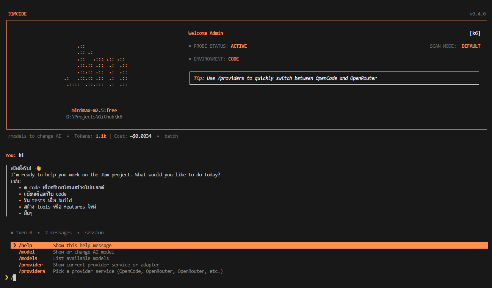

# JimCode




JimCode is an open-source, terminal-based AI coding agent framework. It features a proactive learning loop inspired by Hermes, with 28+ built-in tools for file manipulation, shell commands, web access, social media, office documents, and more. JimCode supports multiple LLM providers, dynamic tool loading via MCP, and structured workflows for planning and execution.

## Highlights

- `28+ built-in tools` plus dynamic MCP tools
- `Multi-model CLI` with searchable model and provider pickers
- `Provider selection` with favorites, recents, presets, and native provider setup modals
- `Work modes` for `architect`, `ask`, and `code`
- `Task board` via `todo_write` with blocked, dependencies, owners, notes, and acceptance criteria
- `AI-driven choice prompts` via `ask_user_choice`
- `Plan approval` guardrail before mutation tools run
- `Sub-agents` with planner/executor/reviewer support
- `Sessions + checkpoints` persisted under `~/.jim`
- `Hooks`, `memory`, `MCP`, and `plugin catalog`
- `User Persona Modeling` persisted under `.jim/user_persona.json`
- `Self-Improving Skill Store` persisted under `.jim/skills/`
- `Memory management` with archive, recall, list, and forget operations
- `Office document tools` for Word, Excel, and PowerPoint
- `Social media access` for YouTube, Twitter/X, and Reddit
- `Browser automation` for web interaction
- `TypeScript checking` with hover info and diagnostics
- `Knowledge graph` for codebase understanding
- `UI themes` for terminal customization
- `YOLO mode` for bypassing safety checks
- `Ollaman` background task support
- `Structured logging` with `pino`
- `Semantic repo map` powered by `ts-morph`
- `Provider metadata registry` for adapter capabilities, transport, and model recommendations

## Quick Start

```bash
# install dependencies
npm install

# run in dev
npm run dev

# or build + run
npm run build
npm start
```

Required environment:

```bash
export OPENAI_API_KEY=sk-...
export OPENAI_MODEL=gpt-4o
```

Optional environment:

```bash
export OPENAI_BASE_URL=https://api.openai.com/v1
export API_MODE=auto
export PROVIDER_PRESET=openai
export MAX_TURNS=25
export MAX_TOOL_OUTPUT=5000
export PERMISSION_MODE=default
export BRAVE_SEARCH_API_KEY=...
export LOG_LEVEL=debug
```

## What Jim Can Do

### Core workflows

- Explore a repo with file reads, grep, project info, and semantic repo maps
- Create a task plan and require approval before edits/commands
- Ask the user to choose between 2-5 concrete options when there are tradeoffs
- Run shell commands, fetch web docs, and use MCP tools
- Spawn sub-agents for exploration or delegated work
- Save sessions and restore checkpoints from the terminal UI
- Query knowledge graph for codebase understanding
- Check TypeScript for errors and get hover information

### Work modes

- `architect`: focus on analysis, alternatives, and planning before edits
- `ask`: focus on explanation, diagnosis, and low-mutation guidance
- `code`: default implementation-oriented mode

## Built-in Tools

### File Operations

| Tool               | Purpose                             |
| ------------------ | ----------------------------------- |
| `read_file`        | Read files with line numbers        |
| `edit_file`        | Exact-match file editing            |
| `write_file`       | Create files or helper scripts      |
| `list_files`       | Glob-based file discovery           |

### Search & Analysis

| Tool               | Purpose                             |
| ------------------ | ----------------------------------- |
| `grep`             | Fast content search with ripgrep    |
| `get_repo_map`     | Semantic repository map             |
| `get_project_info` | Project metadata                    |
| `graph_query`      | Knowledge graph queries             |
| `ts_check`         | TypeScript diagnostics & hover info |

### Execution

| Tool               | Purpose                             |
| ------------------ | ----------------------------------- |
| `run_command`      | Shell execution (sandboxed)         |
| `git_command`      | Safe git operations                 |
| `browser_action`   | Browser automation                  |

### Task Management

| Tool               | Purpose                             |
| ------------------ | ----------------------------------- |
| `todo_write`       | Structured task board               |
| `ask_user_choice`  | Ask the user to pick an option      |
| `reflect`          | Self-reflection and reasoning       |

### Web & Internet

| Tool               | Purpose                             |
| ------------------ | ----------------------------------- |
| `web_fetch`        | Fetch URL content                   |
| `web_search`       | Search the web                      |
| `youtube_transcript` | Extract YouTube video transcripts |
| `twitter_read`     | Read tweets and threads             |
| `reddit_read`      | Read Reddit posts and comments      |
| `social_doctor`    | Diagnose social media tool status   |

### Office Documents

| Tool               | Purpose                             |
| ------------------ | ----------------------------------- |
| `office`           | Create/edit .docx, .xlsx, .pptx     |
| `office_doctor`    | Diagnose OfficeCLI installation     |

### Memory Management

| Tool               | Purpose                             |
| ------------------ | ----------------------------------- |
| `memory_archive`   | Store information to memory         |
| `memory_recall`    | Retrieve information from memory    |
| `memory_list`      | List memory entries                 |
| `memory_forget`    | Remove memory entries               |

### Agents & Plugins

| Tool               | Purpose                             |
| ------------------ | ----------------------------------- |
| `spawn_agent`      | Delegate to a sub-agent             |
| `list_plugins`     | Show built-in and MCP plugin groups |

MCP tools are loaded dynamically from `.mcp.json` and appear as additional tool namespaces at runtime.

## CLI Commands

```text
/reset              Clear conversation
/approve            Approve the current plan
/model [name]       Show or switch model
/models             List models
/provider [name]    Show or switch current service
/providers          Pick a provider service (OpenCode, OpenRouter, etc.)
/adapters           Pick a technical provider adapter (OpenAI, Anthropic, etc.)
/connect [name]     Connect a service by ID
/connections        List all available provider services
/mode <mode>        Permission mode (plan/edit/ask)
/auto-approve       Toggle auto-approve
/workmode [name]    Show or switch architect|ask|code
/modes              Pick a work mode interactively
/learn <fact>       Save a fact to memory
/rules              Show conditional rules
/compact            Compact conversation context
/stream             Toggle streaming mode
/sessions           Browse saved sessions
/load <id>          Load a session
/delete <id>        Delete a session
/checkpoint <label> Create a checkpoint
/checkpoints        Browse checkpoints
/restore <id>       Restore a checkpoint
/themes             Pick a UI color theme
/plugins            Browse plugin catalog
/hooks              Show configured hooks
/memory             Show loaded memory layers
/config             Show current config
/stats              Show usage statistics
/history            Message stats
/yolo               Toggle YOLO mode (bypass all safety)
/ollaman [model]    Toggle Ollaman background tasks
/help               Show help
/quit               Exit
```

## Planning and Approval

Jim is built to plan before mutating.

- For complex work, the agent should create a task board with `todo_write`
- In `plan` and `edit` modes, mutation tools are blocked until the current plan is approved
- In the UI, you can approve a plan with `/approve`

The task board supports:

- `pending`
- `in_progress`
- `blocked`
- `completed`
- `cancelled`
- `priority`
- `owner`
- `depends_on`
- `acceptance_criteria`
- `notes`

## Sessions and Checkpoints

Jim persists runtime state under `~/.jim`.

- Sessions live in `~/.jim/sessions`
- Checkpoints live in `~/.jim/checkpoints`
- Permission decisions also persist under `~/.jim`
- The CLI can browse sessions and checkpoints interactively

## Memory

Jim loads project memory from the repo when available:

- `CLAUDE.md` / `AGENTS.md`
- `LEARNING.md` / `SECURITY.md` / `CONTRIBUTING.md`
- `CLAUDE.local.md`
- `.claude/rules/*.md`
- `MEMORY.md`

Jim also provides runtime memory tools for storing and recalling information during conversations.

## Documentation

For more detailed information, see:

- [LEARNING.md](./LEARNING.md): How Jim learns and adapts to your style.
- [SECURITY.md](./SECURITY.md): Security policy, permissions, and guardrails.
- [CONTRIBUTING.md](./CONTRIBUTING.md): Guidelines for extending Jim and adding new tools.
- [LICENSE](./LICENSE): MIT License terms.

Example conditional rule:

```markdown
---
globs: ["*.ts", "src/**/*.js"]
description: TypeScript rules
alwaysApply: false
---

Use strict TypeScript. Prefer `type` over `interface`.
```

## Hooks

Jim loads hooks from `.hooks.json`.

Example:

```json
[
  {
    "event": "PostToolUse",
    "toolPattern": "edit_file",
    "command": "npx prettier --write . 2>/dev/null || true",
    "description": "Auto-format after edit"
  }
]
```

Supported workflows include lifecycle automation around sessions, tools, and checkpoints.

## MCP

Jim can connect to MCP servers from `.mcp.json`.

Example:

```json
{
  "mcpServers": {
    "filesystem": {
      "command": "npx",
      "args": ["-y", "@modelcontextprotocol/server-filesystem", "/path"]
    }
  }
}
```

At runtime Jim:

- loads MCP servers
- registers MCP tools dynamically
- refreshes tools when servers report changes
- shows plugin groups through `/plugins`

## Models

Jim supports multiple models through various providers. Use `/models` to list available models or `/provider` to view current provider details.

The selected model can be set with `OPENAI_MODEL` or the `/model` command.

Provider selection can be controlled with `API_MODE`:

- `auto`: recommend an adapter from the current model and retry with the alternate wire format on schema mismatch
- `openai`: force the OpenAI Responses API adapter
- `openai-compatible`: force the OpenAI-compatible Chat Completions adapter

You can also switch provider modes inside the CLI with `/provider`, `/providers`, and `/adapters`.

## Provider Presets

Jim ships with an extensive provider preset catalog:

### Popular Providers

| Provider | Description |
|----------|-------------|
| `opencode-zen` | Curated models including Claude, GPT, Gemini |
| `opencode-go` | Low cost subscription for everyone |
| `anthropic` | Direct access to Claude models |
| `openai` | GPT models for fast, capable AI tasks |
| `openrouter` | Universal gateway with per-model pricing |

### Other Providers

| Provider | Description |
|----------|-------------|
| `azure-openai` | Enterprise-grade OpenAI on Microsoft Azure |
| `amazon-bedrock` | AWS-native provider with SigV4 signing |
| `google` | Gemini models via Vertex AI or Studio |
| `groq` | Ultra-fast inference for open source models |
| `mistral` | Mistral and Mixtral models |
| `xAI` | Grok models via OpenAI-compatible endpoint |
| `perplexity` | Search-augmented LLM API |
| `together-ai` | Open source models at high speed |
| `deepinfra` | Low-cost inference for open models |
| `cerebras` | Wafer-scale AI inference |
| `deepseek` | High-performance models like DeepSeek V3 and R1 |
| `kilocode` | High-speed coding specialized models |
| `minimax` | MiniMax-m2.5 specialized in short/long context |
| `moonshot` | Kimi models for long context research |
| `ollama` | Run models locally on your machine |

Use `/connections` to see all available presets and their configuration status.

## Office Documents

Jim provides tools for creating, reading, and modifying Office documents:

- Create .docx, .xlsx, .pptx files
- Add and modify content (text, shapes, slides, cells)
- Query and validate document structure
- Batch operations support

Requires [OfficeCLI](https://github.com/iOfficeAI/OfficeCLI) installation. Run `office_doctor` to check status.

## Social Media Access

Jim can read content from social media platforms:

- **YouTube**: Extract video transcripts and metadata
- **Twitter/X**: Read tweets and threads (requires bird CLI + auth)
- **Reddit**: Read posts with comments via JSON API

Run `social_doctor` to check which tools are available on your system.

## Development

```bash
# install
npm install

# run dev CLI
npm run dev

# typecheck/build
npm run build

# run tests
npm test

# watch tests
npm run test:watch

# run legacy tool tests
npm run test:legacy
```

## Tech Stack

- `TypeScript`
- `React 19`
- `Ink`
- `OpenAI SDK`
- `ts-morph`
- `zod`
- `pino`
- `vitest`

## License

MIT
